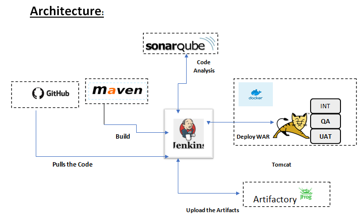

# DevOps:java-web-app

## Author: Charles
## About: Java Application on CICD

## Technologies
- [x] Jenkins
- [x] SonarQube
- [x] Artifactory
- [x] Ansible
- [x] Docker
- [x] Slack

### Workflow
1. SonarQube analysis the code. A Quality gate condition applies.
2. A Maven make step produces a Jar file.
3. The Jar is used to make a docker image that is uploaded to a Artifactory as a private docker registry.
4. Ansible authenticates and pulls the image for Artifactory.
5. Ansible deploys the docker image.
6. Slack is integrated for alerting

> More code follows

--- 

[Resume](https://docs.google.com/document/d/181BAXAK1W-JvjYYh0481z_8wtx9I_hZjrhgNLikde2w/edit?usp=sharing)

--- 

[Linkedin](https://www.linkedin.com/in/gitauwairimu/)
